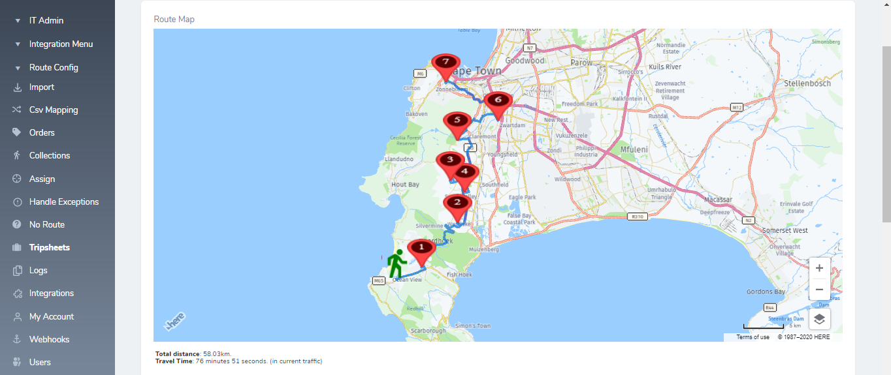

# Project Title

Route Map Larvel Nova Field (Build on top of Here Maps Api)

### Installation
 

composer require haythem/route-map-field

## Test
        use Haythem\RouteMapField\RouteMapField;

        $points = [
            '{"lat":"-34.1380995","lon":"18.3566494","description":"Office"}',
            '{"lat":"-34.12683310","lon":"18.38998250","description":"Customer 1 (INV - FF0607)"}',
            '{"lat":"-34.07817000","lon":"18.43703700","description":"Customer 2 (INV - FF0599)"}',
            '{"lat":"-34.07704120","lon":"18.45559830","description":"Customer 3 (INV - FF0595)"}',
            '{"lat":"-34.07897430","lon":"18.46030930","description":"Customer 4 (INV - FF0597)"}',
            '{"lat":"-34.08988480","lon":"18.46012480","description":"Customer 5 (INV - FF0596)"}',
            '{"lat":"-34.06624000","lon":"18.43453000","description":"Customer 6 (INV - FF0594)"}',
            '{"lat":"-34.04468320","lon":"18.44628980","description":"Customer 7 (INV - FF0598)"}',
            ];
            
        //minimum number of points is two

                    RouteMapField::make('route')
                      ->gpsPoints($points)
                      ->apikey('your-api-key')
                      //->svgMarker('')
                      ->showSummary(true),
                      //->showManuevers(true),
                      ->addCircleToMap(-34.1380995,18.3566494,10000,"rgba(255, 87, 34, 0.5)","rgba(255, 87, 34, 0.5)")
                      ->customErrorMessage("There not enough GPS Points"),

## Result 1

## Result 2

